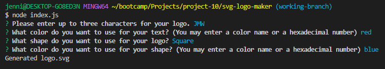
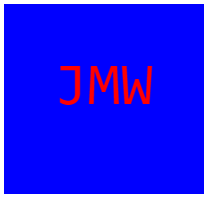
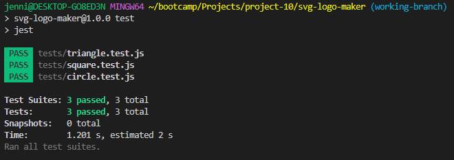

# SVG Logo Maker

## Description 
Command line application that takes in user inputs to create an svg logo.

## Table of Contents
1. [Installation](#installation)
2. [Usage](#usage)
3. [Contributing](#contributing)
4. [Tests](#tests)
5. [License](#license)
6. [Questions](#questions)

## Installation
Clone the repo to your local machine, then open the directory in your terminal. Run npm install to download inquirer and jest.

## Usage
Open the terminal, in the command line type - node index.js - follow the prompts and answer each question as accurately as possible. 
  
Once you have entered your information, an svg logo will be generated. 
  
For an example of the process, please view this video: [Demo Video](https://drive.google.com/file/d/1Gj8uTQEHhmv9o8o8n2atURhNmCuCAZ40/view)

## Contributing
N/A

## Tests
Each shape class has been tested for a render() method that returns a string for the corresponding SVG file with the given shape color. 
To run the tests, enter npm run test in the terminal. 
  

## License
Licensed under the [MIT license](https://opensource.org/license/mit/)

## Questions
You can view my GitHub repository here: [JenWariner19/svg-logo-maker](https://github.com/JenWariner19/svg-logo-maker) 
If you have any questions and would like to contact me, you can email me at: [jenniferwariner@yahoo.com](mailto:jenniferwariner@yahoo.com)